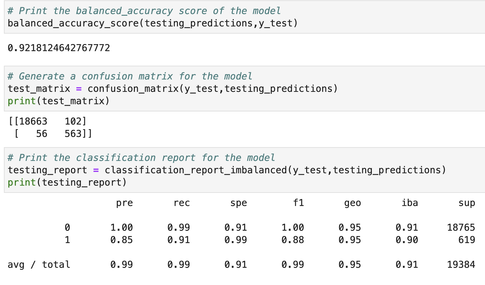
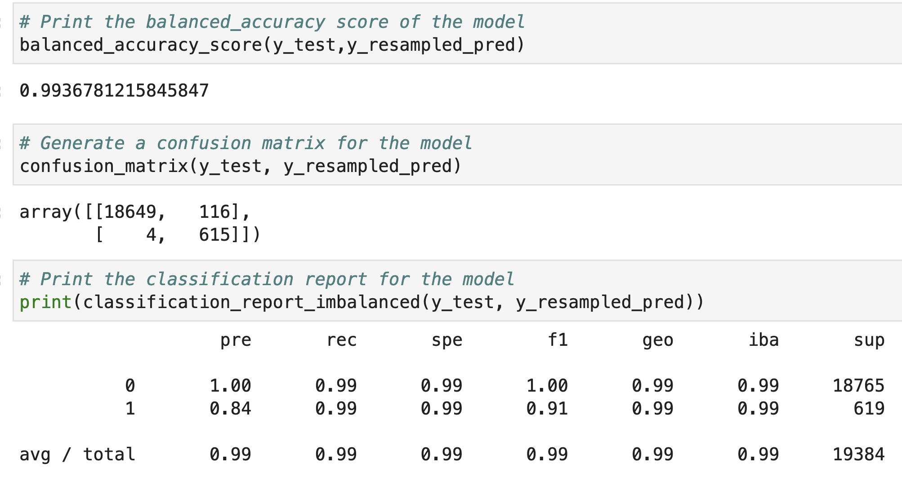

# Credit_Risk_Modeling_Analysis
---
Developing effective ways of modeling credit risk

## Overview of the Analysis

Countless organization use the credit risk modeling including banks, insurance companies, invest firms and government treasuries. Credit risk modeling is the process of using data about a person to determine how likely it is that the person will pay back a loan.Credit risk modeling is ultra important anywhere people are borrowing money.

Credit risk poses a classification problem that’s inherently imbalanced. This is because healthy loans easily outnumber risky loans.Determining sombody's default risk is important in order to mitigate the risk of lending money to them. 

In this project, I used two different techniques to train and evaluate models with imbalanced classes comprised of healthy and high-risk loan in order to recommend the most appropriate model to use. I used a dataset of historical lending activity from a peer-to-peer lending services company to build a model that can identify the creditworthiness of borrowers.The dataset provides the following financial information:
* Loan size
* inetrest rate
* Borrower income
* Debt to income
* Number of accounts Derogatory marks
* Total debt and
* Loan status 

I used a logistic regression model to compare two versions of the dataset. First, I used the original dataset. Second, I resampled the data by using the RandomOverSampler module from the imbalanced-learn library.

For both cases,I perfomed the follwing **Machine Learning** process:

* Prepared the data
* Created the labels set (y) that contains the data from the "loan_status" column of the original DataFrame and then Created a new DataFrame named X that contains the remaining columns(features) from the original DataFrame.
* Checked the magnitude of imbalance in the data set by viewing the number of distinct values (value_counts) for the labels.
* Split the features and labels into Training and Testing Sets
* Resampled the training data by using RandomOverSampler
* Checked the number of distinct values (value_counts) for the resampled labels.
* Created two Logistic Regression  modules: one for the resampled data and another for the original data.
*  Using the two logistic regression models, predicted the values for the original and resampled sets.
* Evaluated the model’s performance by calculating the confusion matrixes, accuracy scores, and classification reports for the original and resampled datasets.

## Results ##

* Machine Learning Model 1:
  
  * Accuracy: The accuracy score for this model is high at .921812464 which means the model was correct 92% of the time.

  * Precision: The prcision is perfect with 1.00 for the 0 class that is healthy loan which means that the model is very good with class 0 and for the class 1 that represents high-risk loan it's 0.85 which means that for every 100 prediction that model made only 85 were correct.So,it's slightly off for unhealthy loans.

  * Recall: The recall for 0 and 1 class almost matches.For healthy loans that is class 0 ,the recall is 99% and for unhealthy loans it's 91% which means model correctly predicted 613(.91 x 619) out of 619 loans that is going to be defaulted.Here, model has done a fairly good job.

* Machine Learning Model 2:
  
  * Accuracy: For the oversampled data the accuracy is very high at 0.9936781 around 99% which means the model was accurate almost all the time.

  * Precision: It has the precision of 1 for class 0(healthy loans) and 0.84 for class 1(high risk loans) which means for healthy loans model was 100% correct but for high risk loan, every 100 prediction that model made only 84 were correct.

  * Recall: Interestingly the recall for both the classes is .99 which means the prediction for both the classes made by the model with the resampled data was 99% accurate.

### Comparing the Results ###

For a final point of examination, I compared the results from the logistic regression model that used oversampling with the logistic regression model that used only the original imbalanced dataset. The following image shows the balanced accuracy scores, confusion matrices, and classification reports that result from running a logistic regression model on the original dataset and the oversampled data:

### Model 1 ###

### Model 2 ###

Taken together the results regarding accuracy of the minority class are actually mixed when comparing the classifiction reports generated from the predictions with the original data versus the predictions with the resampled data.

First, the accuracy score is  higher for the resampled data (92.18% vs 99.36%), meaning that the model using resampled data was better at detecting true positives and true negatives.

The precision for the high-risk loan class is almost similar with the orignal data (0.85) versus the resampled data (0.84) meaning that the original data was little better at detecting the users that were actually going to default.For class 0(healthy loan) both the dataset prduced the same precision of 1.

In terms of the recall, the 1 class(high-risk loan) metric using resampled data was better (0.91 vs 0.99). Meaning that the resampled data correctly classified a higher percentage of the truly defaulting borrowers.For class 0 both the dataset having 99% of recall.

Finally, the F1 score for both the models is 1 for Class 1 but for minor class model 2 is doing better than model 1 (.88 vs .91).

## Conclusion ##

All in, the model using resampled data was better at detecting borrowers who are likely to default that the model generated using the original, imbalanced dataset.But if it's the other way around—that is, flagging too many borrowers as defaulters might cost the company in customer-retention dollars. Additionally,missing a high-risk loan is more costly than miscategorizing a transaction as high-risk loan
.To avoid this, I would recommend to test the model using resampled data with additional test data.If its perfomance score still yield the better results, I would recommend using model 2.

